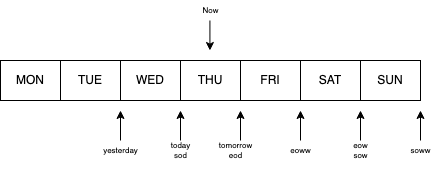

## Timestamps

Times may be specified in a wide variety of convenient formats.

 * [RFC3339](https://datatracker.ietf.org/doc/html/rfc3339) timestamps, such as `2019-10-12 07:20:50.12Z`
 * A date of the format `YYYY-MM-DD` is interpreted as the _local_ midnight at the beginning of the given date.
   Single-digit month and day are accepted, but the year must contain four digits.
 * `now` refers to the exact current time
 * `yesterday`, `today`, and `tomorrow` refer to the _local_ midnight at the beginning of the given day
 * Any duration (described below) may be used as a timestamp, and is considered relative to the current time.

Times are stored internally as UTC.

## Durations

Durations can be given in a dizzying array of units.
Each can be preceded by a whole number or a decimal multiplier, e.g., `3days`.
The multiplier is optional with the singular forms of the units; for example `day` is allowed.
Some of the units allow an adjectival form, such as `daily` or `annually`; this form is more readable in some cases, but otherwise has the same meaning.

 * `s`, `second`, or `seconds`
 * `min`, `mins`, `minute`, or `minutes` (note that `m` not allowed, as it might also mean `month`)
 * `h`, `hour`, or `hours`
 * `d`, `day`, or `days`
 * `w`, `week`, or `weeks`
 * `mo`, or `months` (always 30 days, regardless of calendar month)
 * `y`, `year`, or `years` (365 days, regardless of leap days)

[ISO 8601 standard durations](https://en.wikipedia.org/wiki/ISO_8601#Durations) are also allowed.
While the standard does not specify the length of "P1Y" or "P1M", Taskchampion treats those as 365 and 30 days, respectively.

## Named Timestamps

Some commonly used named timestamps

 * `today` Start of today
 * `yesterday` Start of yesterday
 * `tomorrow` Start of tomorrow
 * `sod` Start of today
 * `eod` End of today
 * `sow` Start of the next week
 * `eow` End of the week
 * `eoww` End of work week
 * `soww` Start of the next work week

